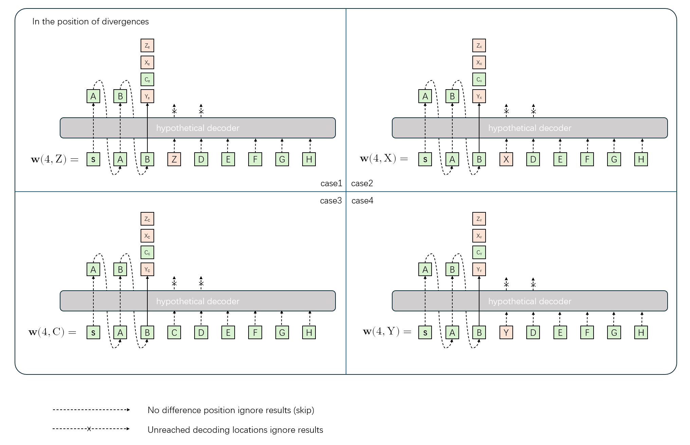
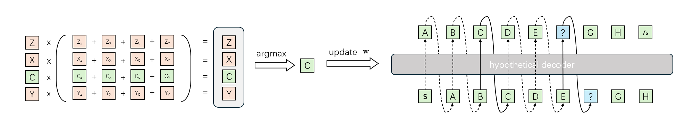

# Hypformer

This repository contains the code accompanying the paper "Hypformer: A Fast Hypothesis-Driven Rescoring Speech Recognition Framework". The entire model is straightforward, with a hypothetical decoder added on top of the Paraformer. For detailed training methods, please refer to the paper.

This code is developed based on FunASR version 1.1.4 and has not been tested on newer versions of FunASR.
**To run the code, simply place the corresponding files in the appropriate folders within FunASR.**

**Note:** The code has not been systematically organized yet, so it may appear somewhat disorganized.

Hpyformer provides two different decoding methods: nar-ar rescoring 和 nar2 rescoring. Both methods are based on rescoring the hypothesis prefixes generated by Paraformer. We developed a non-autoregressive fast hypothesis prefix generation method for Paraformer. This is the origin of the first "nar." For detailed generation specifics, please refer to the paper.

## nar-ar rescoring

Stage 1, initialize <b>w</b> = w1 based on the hypothesis prefixes, and then identify the positions where divergences occur among these prefixes.

Stage 2, based on the divergent positions, calculate the results sequentially from front to back.

e.g.

For example, if there are four candidate tokens at the first divergent position, we will sequentially fill the divergent position with each candidate token to provide hypothesis prefixes for future time steps. As for the tokens before the first divergent position, we consider their results to be certain and do not need to recalculate their scores, so they can be ignored. The tokens after the first divergent position are not yet due for calculation, so their results are also ignored.

Stage 3, based on the divergent positions, calculate the results sequentially from front to back.

The score of the candidate tokens at the current position is calculated based on the output results, combined with the probability of their occurrence in the hypothesis prefix, which is why it is referred to as rescoring. The final result for this position is determined based on the rescoring outcome, and the result is then updated into $\bf{w}$. The process is repeated for the next divergent position with the stage 2 calculation. This process is similar to autoregressive decoding, where the confirmed content continuously updates the uncertain content, ultimately achieving rescoring-based decoding, which is why it is called nar-ar rescoring.

## nar2 rescoring

nar-nar (nar2) rescoring, on the other hand, computes everything in one step. All hypothesis prefixes are fed into the hypothesis decoder at once to obtain the corresponding results. These results are combined with their original probabilities to get the rescoring outcomes. Since the hypothesis decoder performs decoding in a single step, it is called nar-nar rescoring.

## Result

### Aishell-1

|        decode methods         | dev  | test |
| :---------------------------: | :--: | :--: |
| paralle decoder greedy search | 4.52 | 4.99 |
|       nar-ar rescoring        | 4.31 | 4.73 |
|       nar2 rescoring       | 4.34 | 4.76 |

| err prob | nar2 rescoring | nar-ar rescoring |
| :------: | :---------------: | :--------------: |
|    0%    |    4.41 / 4.89    |   4.39 / 4.87    |
|   10%    |    4.39 / 4.80    |   4.34 / 4.78    |
|   20%    |    4.34 / 4.76    |   4.31 / 4.73    |
|   30%    |    4.43 / 4.92    |   4.39 / 4.92    |

### Aishell-2

|        decode methods         | dev  | test |
| :---------------------------: | :--: | :--: |
| paralle decoder greedy search | 5.46 | 5.73 |
|       nar-ar rescoring        | 5.13 | 5.46 |
|       nar2 rescoring       | 5.14 | 5.43 |

### LibriSpeech-960h

coming soon

|        decode methods         | test clean | test other |
| :---------------------------: | :--------: | :--------: |
| paralle decoder greedy search |     6.06       |     9.87       |
|       nar-ar rescoring        |      4.36      |       8.20     |
|       nar2 rescoring       |     4.50       |      8.29      |

### KeSpeech

|        decode methods         | test  |
| :---------------------------: | :---: |
| paralle decoder greedy search | 10.45 |
|       nar-ar rescoring        | 8.37  |
|       nar2 rescoring       | 8.28  |
